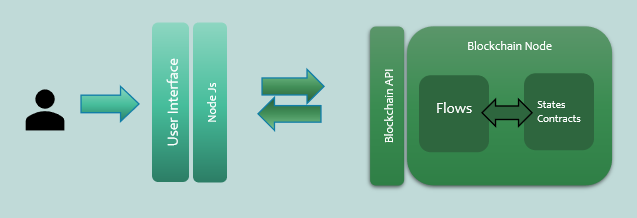

# Corda Reference Project
Reference project for various best practices used in Corda.

Corda Blockchain generally follows the following Architecture structure:

<p align="center">
  
</p>

The objective of this program is to insert,update,delete and query key-value pairs from db using Corda Blockchain. In 
this project we will tackle the Blockchain layer and Blockchain API layer. The Blockchain layer is coded in Kotlin 
language and API in Springboot. The project contains a single node which interacts with the PostgreSQL DB through the 
corda flows. **No State or Contract is initiated in this Project**. The project also contains web apis for creating, 
updating and querying in the db.

## Downloading the reference project
Clone or download the zip of reference project from following location.

## Prerequisite
(1) Download and install latest IntelliJ Idea IDE from Wipro WASP request.

(2) Download and install Oracle JDK  1.8.0_XXX version from Oracle site or Wipro WASP request
    Following open JDK's are supported
    (a) Amazon Corretto
    (b) Red Hat’s OpenJDK
    (c) Zulu’s OpenJDK
     
(3) Download and install PostgreSQL DB server from Wipro WASP request.

(4) Download and install Postman API test tool from Wipro WASP request.

## Opening the reference project in IntelliJ 
* Open IntelliJ
* A splash screen will appear. Click 'open', navigate to and select the 'CordaReferenceProject-master' folder, and click OK
* Once the project is open, click 'File', then 'Project Structure'. Under Project SDK:, set the project SDK by clicking New..., clicking JDK, and navigating to C:\Program Files\Java\jdk1.8.0_XXX on Windows (where XXX is the latest minor version number). Click Apply followed by OK
* Again under 'File' then 'Project Structure', select 'Modules'. Click +, then 'Import Module', then select the 'CordaReferenceProject-master' folder and click 'Open'. Choose to Import module from external model, select 'Gradle', click 'Next' then 'Finish' (leaving the defaults) and OK
* Gradle will now download all the project dependencies and perform some indexing. This usually takes a few minutes.

## Project Structure
The key files and directories are as follows:

* The root directory contains some gradle files, a README and a LICENSE
* config contains log4j2 configs
* gradle contains the gradle wrapper, which allows the use of Gradle without installing it yourself and worrying about which version is required
* lib contains the Quasar jar which rewrites our CorDapp’s flows to be checkpointable
* clients contains the source code for spring boot integration
* workflows contain the source code, written in Kotlin. CorDapps can be developed in either Java and Kotlin

## Running the nodes
This program uses PostgreSQL db rather than the default h2 db so we need to download a jar file for this code to execute.
1. #### Database Setup
     
    (a) Download PostgreSQL jar compatible with our code. This can be found at 
    https://jdbc.postgresql.org/download.html (version 42.1.4 or higher). Put the jar in some appropriate location.
    
    (b) Change the path of node property **'jarDirs'** present in **'extraConfig'** for the corresponding node.
    
    _Note: If PostgreSQL is not available then we can comment property **'extraConfig'**. Then system will automatically consider H2 as default database. Since H2 is in memory DB hence data will wipe out once the node is stopped._

2. #### Building the reference project
    * Open a terminal window in the project root directory e.g. 'CordaReferenceProject-master'
    * Run 'clean' and 'deployNodes' Gradle task to build the node with our CorDapp already installed
        * Unix/Mac OSX: ./gradlew clean
        * Unix/Mac OSX: ./gradlew deployNodes
        
        * Windows: gradlew.bat clean
        * Windows: gradlew.bat deployNodes
    * After the build finishes, you will see the following output in the build/nodes folder:
        * 'build' folder inside directory 'CordaReferenceProject-master' 
        * 'nodes' folder inside 'build' folder, this will contain various folders for each generated node.
        * A runnodes shell script/runnodes.bat batch file for running all the nodes simultaneously on Windows/Linux

3. #### Running the reference project
   
   Start the CORDA nodes by running the following command from the root folder e.g. 'CordaReferenceProject-master'
      * Unix/Mac OSX: ./build/nodes/runnodes
      * Windows: .\build\nodes\runnodes.bat 
    
    
## Interacting with the nodes

### Shell

When started via the command line, each node will display an interactive shell.
You can use this shell to interact with your node.
You can find out more about the node shell [here](https://docs.corda.net/shell.html)

### Webserver

`clients/src/main/kotlin/com/flowdb/webserver/` defines a simple Spring webserver that connects to a node via RPC and
allows you to interact with the node over HTTP.

The API endpoints are defined here:

     clients/src/main/kotlin/com/flowdb/webserver/Controller.kt

#### Running the webserver

By default, webserver connects to the node with RPC address `localhost:10006` with
the username `user1` and the password `test`, and serves the webserver on port `localhost:10050`.

##### Via the command line

Start the spring boot webserver by running following command from the root folder 'CordaReferenceProject-master'         

   * Unix/Mac OSX: ./gradlew runTemplateServer        
   * Windows: gradlew.bat runTemplateServer

##### Via IntelliJ

Run the `Run Template Server` run configuration. By default, it connects to the node with RPC address `localhost:10006`
with the username `user1` and the password `test`, and serves the webserver on port `localhost:10050`.

#### Interacting with the webserver

1. The endpoints include:

    * http://localhost:10050/queryToken (GET Endpoint)
    * http://localhost:10050/addToken  (POST Endpoint)
    * http://localhost:10050/updateToken  (POST Endpoint)

2. Open Postman tool and send GET/POST request as per requirement.

## Logging

Here is the steps to implement logging in Kotlin.

1. First we need to include the necessary dependencies. The below is and example of Log4J but the same patterns and 
solutions apply to SLF4J, JUL, and other logging libraries.
    ```gradle
    dependencies {
    compile group: 'org.apache.logging.log4j', name: 'log4j-api', version: '2.12.0'
    compile group: 'org.apache.logging.log4j', name: 'log4j-core', version: '2.12.0'
    }
    ```
    Refer file: _"/CordaReferenceProject-master/clients/build.gradle"_

2. Logging is done by mainly by using companion objects in Kotlin. The below code shows how to define logger object to do 
logging in class
    ```Kotlin
    class LoggerInCompanionObject {
       companion object {
        private val loggerWithExplicitClass
          = LoggerFactory.getLogger(LoggerInCompanionObject::class.java)
       }  
       //...
    }
    ```
    So, with the above code, we can use the logger, in any method of the class:
    ```Kotlin
    fun loggingExample(s: String) {
       loggerWithExplicitClass.info(s)
    }
    ```
    Refer file: _"/com/flowdb/webserver/Controller.kt"_ 

## Exception Handling

All exception classes in Kotlin are descendants of the class Throwable. Every exception has a message, stack trace and 
an optional cause.<br>
To throw an exception object, use the throw-expression:
``` Kotlin
throw IllegalArgumentException("Unknown party name.")
```
To catch an exception, use the try-expression:
``` Kotlin
try {
    // some code
}
catch (e: SomeException) {
    // handler
}
finally {
    // optional finally block
}
```

## Database connection

Corda uses H2 Database by default as its DB to maintain the Node vaults and all the data in the flows and states. 
Nodes can also be configured to use PostgreSQL and SQL Server.

### PostgreSQL
Nodes can also be configured to use PostgreSQL 9.6, using PostgreSQL JDBC Driver 42.1.4. Here is an example node 
configuration for PostgreSQL which is should be added in build.gradle :
``` gradle
extraConfig = [
                'dataSourceProperties.dataSource.url' : 'jdbc:postgresql://localhost:5432/postgres',
                'dataSourceProperties.dataSourceClassName' : 'org.postgresql.ds.PGSimpleDataSource',
                'dataSourceProperties.dataSource.user' : 'postgres',
                'dataSourceProperties.dataSource.password' : 'password',
                'jarDirs' : [ 'E:/' ]
        ]
```
It should be noted that you must have driver jar in the location specified in the jarDirs.

### SQLServer
Nodes also have untested support for Microsoft SQL Server 2017, using Microsoft JDBC Driver 6.2 for SQL Server. Here is 
an example node configuration for SQLServer:
```gradle
dataSourceProperties = {
    dataSourceClassName = "com.microsoft.sqlserver.jdbc.SQLServerDataSource"
    dataSource.url = "jdbc:sqlserver://[HOST]:[PORT];databaseName=[DATABASE_NAME]"
    dataSource.user = [USER]
    dataSource.password = [PASSWORD]
}
database = {
    transactionIsolationLevel = READ_COMMITTED
}
jarDirs = ["[FULL_PATH]/sqljdbc_6.2/enu/"]
```

## Database operations

Database operations are done by creating 2 service layers. First is used to query statements to the DB so the operations 
can be executed. Second is to connect the flows to db service layer. The DB service layer code is a standard code and 
can be used directly. The second layer needs to be configured according to project and must create the query statement 
the will be executed in the DB.

Examples of these can be found in the DatabaseService.kt and CryptoValuesDatabaseService.kt files in the reference project 
Refer file: _"com/flowdb/DatabaseService.kt"_
_"com/flowdb/CryptoValuesDatabaseService.kt"_

## Rest API definition/creation

To execute anything on the Corda network from client we need to create apis for the network. RPC opertaions are done by 
using the rpcOps from the corda core dependencies. 

First we need to establish a connection to node using a valid RPC login.
``` Kotlin
val client = node.rpcClientToNode()
client.start("user", "password")
val proxy = client.proxy()
```
This can also be done by creating a seperate file for configuration which is what we generally use since the same 
endpoints can be called by different users with different roles, examples for this can be found in the reference project 
within th client cordapp.

Next we need to create the endpoints for the API's we need.
``` Kotlin
@GetMapping(value = ["/queryToken"], produces = arrayOf("application/json"))
private fun queryTokenFun(req: RequestEntity<TokenModel>): ResponseEntity<Any> {
        // Put code here...
    }
```
Here the example follows the springboot method of creating endpoints. We generally create structure models to accept 
input and generate output to make it more structurally uniform.